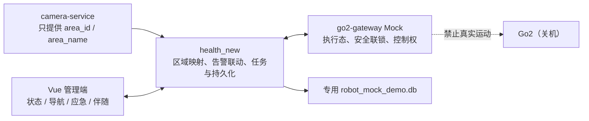

# 机器人 Mock 阶段冻结验收报告

> 阶段：Step 4.4  
> 验收日期：2026-07-23  
> 结论：Mock 阶段通过并冻结；不得自动进入真实硬件阶段。

## 1. 架构与职责



冻结边界：

- camera-service 不包含目标点、坐标、朝向或控制字段；
- health_new 负责区域到观察点映射、机器人任务、告警与应急闭环；
- go2-gateway 负责 Mock 执行状态、安全联锁和控制权；
- 前端只消费冻结 REST/WS 合同，不自行拼接状态；
- 真实硬件后续必须新增 Provider/适配层。

## 2. 完成范围

- 安全启停与健康检查脚本；
- 专用 demo seed/cleanup；
- active map、home、observation、3 个 patrol 点和巡逻路线；
- 巡逻、人工接管、释放、显式继续、到达、返航、完成；
- safe_response 完整应急闭环；
- need_help、no_response、uncertain 人工升级；
- 六类联锁阻断；
- REST/WS 一致性、多页面、重启恢复和资源释放检查；
- 比赛操作、讲解、降级和本验收报告；
- 两项实际联调回归修复：
  1. 保存并复用 Gateway `task_id`；
  2. 人工接管 DTO 不再发送 Gateway 严格 Schema 禁止的额外字段。

## 3. 未完成范围

- 真实 Go2、DDS 和运动；
- Ubuntu 22.04 / ROS2 Humble；
- 真实 L1 点云、IMU、里程计与 TF；
- 二维投影、SLAM Toolbox、Nav2；
- 真实麦克风、扬声器、讯飞 ASR/TTS、Qwen；
- camera-service 和 Flutter 改造；
- 真实导航、真实返航和现场长期稳定性。

## 4. REST 清单

go2-gateway Mock：

- `GET /api/navigation/capabilities`
- `GET /api/navigation/state`
- `GET /api/navigation/maps/active`
- `GET /api/navigation/control`
- `POST /api/navigation/mapping/start|stop`
- `POST /api/navigation/maps/save`
- `POST /api/navigation/patrol/start`
- `POST /api/navigation/emergency/dispatch`
- `POST /api/navigation/tasks/{task_id}/pause|resume|stop`
- `POST /api/navigation/control/manual-takeover`
- `POST /api/navigation/control/release`
- `POST /api/navigation/return-home`
- `POST /api/navigation/mock/scenario`

health_new：

- `GET /api/v1/robot/navigation/capabilities|state|maps|maps/active|points|routes`
- `POST /api/v1/robot/navigation/routes/{route_id}/start`
- `POST /api/v1/robot/navigation/tasks/{task_id}/pause|resume|stop|manual-acquire|manual-release`
- `GET /api/v1/robot/navigation/tasks/{task_id}/timeline`
- `GET /api/v1/robot/tasks/{task_id}/navigation-events`
- `GET /api/v1/robot/emergency/{incident_id}`
- `POST /dispatch|acknowledge|escalate|resolve-and-return`
- `POST /mock/dialogue/start`
- `POST /mock/return/complete`
- `GET /dialogue`

所有成功响应均验证 `provider=mock`、`real_motion_enabled=false`。

## 5. WebSocket 与页面

WebSocket：

- `/ws/robot/status`
- `/ws/robot/navigation`
- `/ws/robot/emergency/{incident_id}`
- `/ws/robot/point-cloud`
- `/ws/alarms`
- Gateway 上游 `/ws/navigation/state` 与 `/ws/navigation/point-cloud`

页面：

- `#/robot-status`
- `#/robot-navigation`
- `#/robot-emergency?incidentId=...`
- `#/robot-follow`

自动验收采集 65 次 REST、187 条 WebSocket 摘要和 36 次页面 WebSocket 建连记录。受控重启时页面建连记录由 11 增至 21，SQLite 中巡逻完成事件仍可读取。四页并行打开、关闭其中一页后其余页面继续工作。短时浏览器堆从 23,671,774 增至 23,682,294 字节，无持续明显增长。

受控重启和可选 8093 视频占位产生 33 条预期的 `ERR_CONNECTION_REFUSED/503` 控制台记录；逐条分类后无其他错误类型，不构成持续无变化推送或异常风暴。

## 6. 数据库

专用数据库：`D:\health_new\data\robot_mock_demo.db`

涉及表：

- `robot_maps`
- `robot_map_points`
- `robot_patrol_routes`
- `robot_patrol_route_points`
- `robot_tasks`
- `robot_task_timeline`
- `robot_observations`
- `robot_navigation_events`
- `robot_emergency_cases`
- `robot_dialogue_turns`

清理前：

- 1 map、5 points、1 route、3 route points；
- 11 tasks、61 timeline、61 navigation events；
- 10 emergency cases、4 dialogue turns。

清理后：

- 固定 1 map、5 points、1 route、3 route points 保留；
- 动态 tasks、timeline、events、cases、dialogue turns 全部为 0。

清理只接受名为 `robot_mock_demo.db` 的数据库，并拒绝正式 `data/app.db`。

## 7. 状态机与安全联锁

冻结任务状态：

```text
created → safety_checking → blocked/queued → navigating
→ paused_manual/paused_admin → arrived
→ voice_prompting → waiting_response
→ safe_response/help_requested/no_response/uncertain
→ waiting_admin_confirmation → returning_home
→ completed/failed/cancelled
```

人工释放控制权不会自动继续；继续和返航必须重新经过安全联锁。

七项联锁：

- `robot_online`
- `emergency_stop_clear`
- `localization_valid`
- `map_loaded`
- `path_plannable`
- `robot_stationary`
- `control_available`

阻断结果：

| 场景 | blocked_by |
|---|---|
| localization_invalid | `LOCALIZATION_INVALID` |
| map_not_loaded | `MAP_NOT_LOADED` |
| emergency_stop_active | `EMERGENCY_STOP_ACTIVE`, `CONTROL_NOT_AVAILABLE` |
| robot_offline | `ROBOT_OFFLINE` |
| path_not_plannable | `PATH_NOT_PLANNABLE` |
| manual_takeover | `CONTROL_NOT_AVAILABLE` |

## 8. 场景验收

- 巡逻：`navigating → paused_manual → release/NONE → explicit resume → arrived → returning_home → completed`，通过。
- safe_response：对话三段状态、管理员确认、二次联锁、返航和 resolved 闭环，通过。
- need_help：进入 `help_requested`，禁止返航，通过。
- no_response：进入 `no_response`，禁止返航，通过。
- uncertain：进入 `uncertain`，禁止返航，通过。
- blocked：六类机器可读原因均正确，Gateway 未走成功导航路径，通过。
- 重启：Gateway、后端和前端重启后任务持久化、REST 重同步和浏览器 WS 重连，通过。

## 9. 测试结果

go2-gateway：

```text
pytest -q
250 passed（退出码 0）
```

health_new：

```text
compileall backend: passed
机器人定向测试: 96 passed
全量: 241 passed / 15 existing failed
```

进入本轮基线为 239 passed / 15 existing failed；新增 2 个联调回归测试，失败集合未增加。15 项仍属于既有 demo/device/RAG/runtime/video-bridge 范围，本轮未修改。

Vue：

```text
test:robot-status       passed
test:robot-navigation   passed
test:robot-emergency    passed
test:robot-follow       passed
四组定向 lint           passed
build                    passed
typecheck                12 个既有错误
全量 lint                6 个既有错误
qa:robot-mock-full       passed
```

typecheck/lint 数量与进入本轮基线一致，没有新增机器人范围错误。

## 10. 真实设备隔离证明

- 机器人全程关机；
- 子进程强制 `GO2_MODE=mock`；
- `GO2_CONTROL_ENABLED=false`；
- `GO2_ROBOT_IP` 与 `UNITREE_ROBOT_IP` 均为 `127.0.0.1`；
- DDS state requirement 关闭；
- Gateway/主系统只访问回环地址；
- 未启动 ROS2、Nav2、SLAM；
- 未调用 `robot_service.move()` 或真实 SDK 运动接口；
- 未接入真实点云、音频、讯飞或 Qwen；
- 正式 `data/app.db` 启动前 SHA-256：
  `6F39A793A7EBEBEB867EF906B92925B97146F46C58FC9459BD3041AD9FABCEB8`；
- 验收健康检查确认该哈希未变化。

## 11. 证据

```text
D:\health_new\artifacts\robot_mock_acceptance\
├── evidence\acceptance-result.json
├── evidence\rest-summary.json
├── evidence\websocket-summary.json
├── evidence\browser-websocket-summary.json
├── evidence\cleanup-summary.json
├── screenshots\*.png
├── tests\*.txt
├── runtime\process-manifest.json
└── logs\*.log
```

证据不包含 API Key、密码、完整音频、完整点云或敏感用户数据。

## 12. 风险与下一阶段技术问题

- 真实 L1 数据格式、频率、时间戳和坐标系尚未验证；
- DDS 无真实机器人状态样本问题仍需独立处理；
- 需确定 ROS2 驱动、TF 树、时间同步和二维投影；
- 需测量定位漂移、地图质量、足式运动对点云的影响；
- 需定义 Nav2 与 Go2 速度控制适配及硬件级急停；
- 需在真实环境验证人群、玻璃、狭窄空间和返航失败；
- 真实 Provider 必须保持现有 DTO、错误码和状态机兼容。

## 13. 冻结结论

以下内容正式冻结：

- Mock REST API 与 WebSocket；
- 四个页面路由；
- SQLite 机器人领域模型；
- 状态机和控制权枚举；
- 七项安全联锁字段；
- `provider=mock`；
- `real_motion_enabled=false`；
- camera-service、health_new、go2-gateway 的职责边界。

后续真实硬件阶段不得直接改写这些稳定前端合同，应新增 Provider 或适配层。Step 4.4 到此停止。
